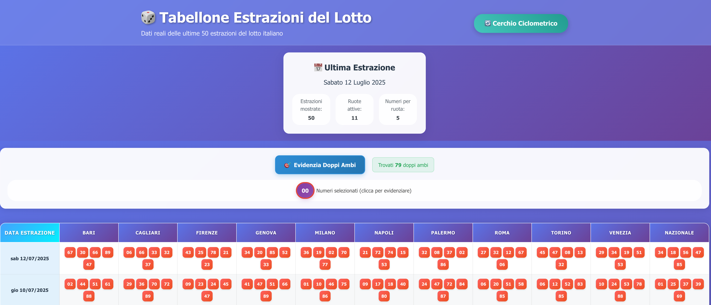
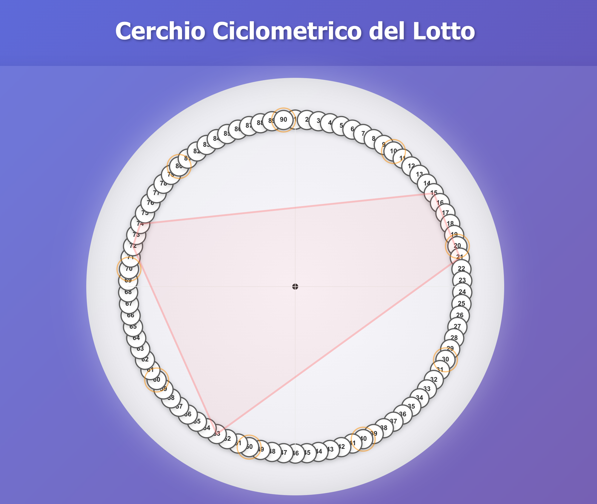

# 🎲 Lotto View - Tabellone e Analisi Ciclometrica

Un'applicazione web moderna per visualizzare le estrazioni del lotto italiano con tabellone interattivo e analisi ciclometrica avanzata per previsioni e statistiche.

## 📸 Screenshots

### Tabellone delle Estrazioni


### Cerchio Ciclometrico con Analisi


## ✨ Caratteristiche Principali

### 📊 **Tabellone Interattivo**
- **50 estrazioni storiche**: Visualizza le ultime 50 estrazioni del lotto italiano
- **Selezione numeri**: Clicca su qualsiasi numero per evidenziarlo in tutte le estrazioni
- **Doppi ambi**: Rileva e evidenzia automaticamente i doppi ambi presenti
- **Design responsive**: Interfaccia moderna che si adatta a tutti i dispositivi

### ⭕ **Cerchio Ciclometrico**
- **90 numeri interattivi**: Cerchio completo con tutti i numeri del lotto (1-90)
- **Selezione ruote**: Scegli qualsiasi ruota per l'analisi ciclometrica
- **Visualizzazione poligoni**: Mostra le distanze ciclometriche come poligoni colorati
- **Predizioni intelligenti**: Sistema di previsioni basato su algoritmi ciclometrici avanzati

### 🔮 **Sistema di Predizioni**
- **Ambate ciclometriche**: Suggerimenti per numeri singoli basati su distanze matematiche
- **Ambi intelligenti**: Previsioni per coppie di numeri (consecutivi, speculari, distanze specifiche)
- **Confidence score**: Ogni previsione include un punteggio di affidabilità
- **Spiegazioni dettagliate**: Mostra il ragionamento dietro ogni suggerimento

## 🎯 Ruote del Lotto

L'applicazione mostra le estrazioni per tutte le ruote del lotto italiano:
- Bari, Cagliari, Firenze, Genova, Milano
- Napoli, Palermo, Roma, Torino, Venezia
- Nazionale

## 🚀 Come iniziare

### Prerequisiti
- Node.js (versione 20 o superiore)
- npm o yarn

### Installazione

1. Clona il repository o scarica i file
2. Installa le dipendenze:
```bash
npm install
```

3. Avvia l'applicazione in modalità sviluppo:
```bash
npm run dev
```

4. Apri il browser e vai su `http://localhost:5173`

### Build per produzione

```bash
npm run build
```

I file di produzione saranno generati nella cartella `dist/`.

## 🛠️ Tecnologie utilizzate

- **React 18**: Framework moderno con hooks e componenti funzionali
- **TypeScript**: Linguaggio tipizzato per codice robusto e manutenibile  
- **Vite**: Build tool ultra-veloce con hot module reloading
- **CSS3**: Styling avanzato con gradients, animazioni e SVG
- **Algoritmi Matematici**: Calcoli ciclometrici per analisi predittiva

## 🎯 Algoritmi Ciclometrici

L'applicazione utilizza algoritmi matematici avanzati per l'analisi:
- **Distanze ciclometriche**: Calcolo delle distanze minime nel cerchio 1-90
- **Pattern detection**: Rilevamento di sequenze e ricorrenze numeriche
- **Analisi statistica**: Frequenze, ritardi e distribuzioni dei numeri
- **Previsioni ponderate**: Suggerimenti basati su multiple variabili matematiche

## 📱 Design Responsive

L'applicazione è completamente responsive e ottimizzata per:
- Desktop (1200px+): Visualizzazione completa con tutti i dettagli
- Tablet (768px+): Layout adattivo mantenendo funzionalità
- Mobile (320px+): Interface touch-friendly e navigazione semplificata
- Tablet (768px - 1199px)
- Mobile (< 768px)

## 🔮 Funzionalità future

- Integrazione con API reali del lotto
- Filtri per date e ruote specifiche
- Statistiche e analisi dei numeri
- Notifiche per nuove estrazioni
- Modalità dark/light

## 📄 Licenza

Questo progetto è libero da usare per scopi educativi e dimostrativi.

---

Creato con ❤️ usando React, TypeScript e Vite
